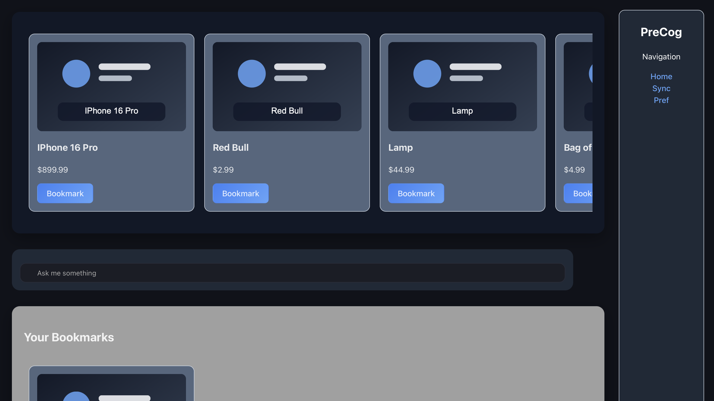
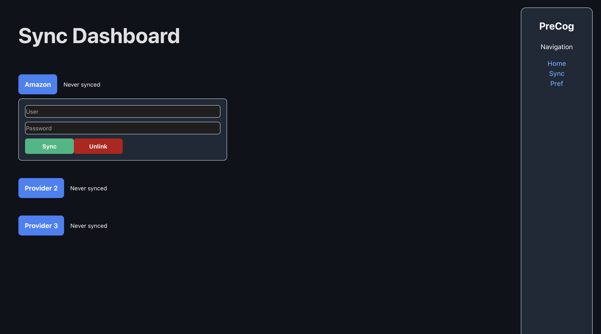

# PreCog

PreCog is an AI-powered shopping assistant that connects purchase history to real-time Amazon product data so users can discover smarter, more personalized recommendations. It combines a React frontend, a Go backend, a Python Amazon sync worker, SQLite persistence, SerpApi product search, and OpenAI-powered recommendation/chat flows.

## About

PreCog was designed to turn past shopping behavior into future purchase guidance.

- Syncs Amazon order history into a local SQLite database
- Searches live Amazon listings through SerpApi
- Normalizes product details like title, price, rating, image, and product link
- Creates a foundation for AI-driven recommendations and chat-based assistance
- Supports mock sync mode for development when Amazon auth challenges block live testing

## Preview

### PreCog Home



### PreCog Sync



## What The App Does

- Lets a user connect Amazon account credentials from the frontend
- Syncs and stores past Amazon order history
- Refreshes data safely so failed syncs do not wipe previous history
- Pulls live Amazon search results to enrich recommendation candidates
- Supports chat and recommendation workflows powered by OpenAI tooling

## Here's How This App Can Help You!

- See personalized shopping suggestions based on what you have already bought
- Discover updated versions, accessories, and complementary products without manually searching
- Keep your recommendation feed grounded in real Amazon listings instead of generic ideas
- Use a chat-style workflow to explore products, preferences, and follow-up recommendations
- Prototype and test recommendation logic locally with mock purchase history before going live

## Tech Stack

- Frontend: React, Vite, React Router
- Backend: Go, `net/http`
- Database: SQLite
- Sync Worker: Python, `amazon-orders`, `python-dotenv`
- Search: SerpApi Amazon Search API
- AI Layer: OpenAI API

## Project Structure

```text
Sparkhacks2026/
├── backend/              # Go API server, SQLite access, sync/search endpoints
├── frontend/my-app/      # React + Vite frontend
├── docs/                 # README screenshots
└── README.md
```

## Running The App

### Prerequisites

- Go installed
- Node.js and npm installed
- Python 3.11+ installed
- A SerpApi key
- An OpenAI API key if you want to use LLM/chat functionality

### 1. Start the backend

```bash
cd backend

python3 -m venv .venv
source .venv/bin/activate
pip install amazon-orders python-dotenv

# Create or update backend/.env
cat <<'EOF' > .env
SERPAPI_API_KEY=your_serpapi_key
OPENAI_API_KEY=your_openai_api_key

# Optional: use mock Amazon history instead of live login
AMAZON_MOCK_SYNC=1
EOF

go run . -python ./.venv/bin/python
```

The backend runs on `http://localhost:8080`.

### 2. Start the frontend

Open a second terminal:

```bash
cd frontend/my-app
npm install
npm run dev
```

The frontend usually runs on `http://localhost:5173`.

### 3. Open the app

Visit:

```text
http://localhost:5173
```

## Recommended Local Workflow

1. Start the backend
2. Start the frontend
3. Open the Sync page and connect or test with mock mode
4. Trigger a sync
5. Return to the Home page to view recommendations and product cards

## Useful Environment Variables

Place these in `backend/.env`:

```env
SERPAPI_API_KEY=your_serpapi_key
OPENAI_API_KEY=your_openai_api_key
AMAZON_MOCK_SYNC=1
AMAZON_OTP_KEY=your_optional_otp_secret
```

Notes:

- `SERPAPI_API_KEY` powers live Amazon search results and product images
- `OPENAI_API_KEY` powers LLM/chat functionality
- `AMAZON_MOCK_SYNC=1` is the easiest way to test locally without Amazon login friction
- `AMAZON_OTP_KEY` is optional and only needed for supported OTP flows

## Quick Checks

### Backend health check

```bash
curl http://localhost:8080/test-connection
```

### Test Amazon search

```bash
curl -s "http://localhost:8080/amazon-search?query=lamp&limit=1"
```

### Build the frontend

```bash
cd frontend/my-app
npm run build
```

## Notes And Limitations

- Live Amazon sync may fail if Amazon presents a JavaScript or captcha challenge
- Mock sync mode is included specifically to keep development moving when that happens
- This project currently favors prototype velocity over production security hardening
- Product recommendation quality improves as the recommendation pipeline becomes more tightly connected to synced order history and live search results

## Future Direction

- Stronger recommendation ranking based on purchase history patterns
- Richer chat interactions around product discovery
- Better provider/account management flows
- Production-grade credential handling and security improvements
